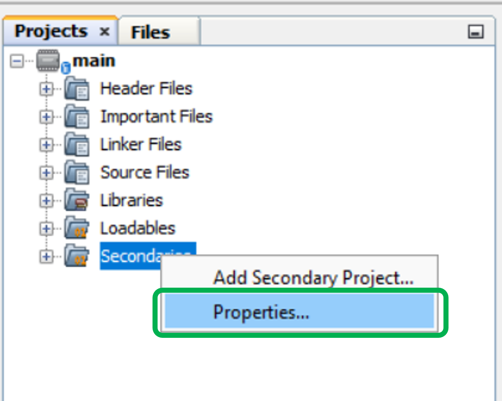
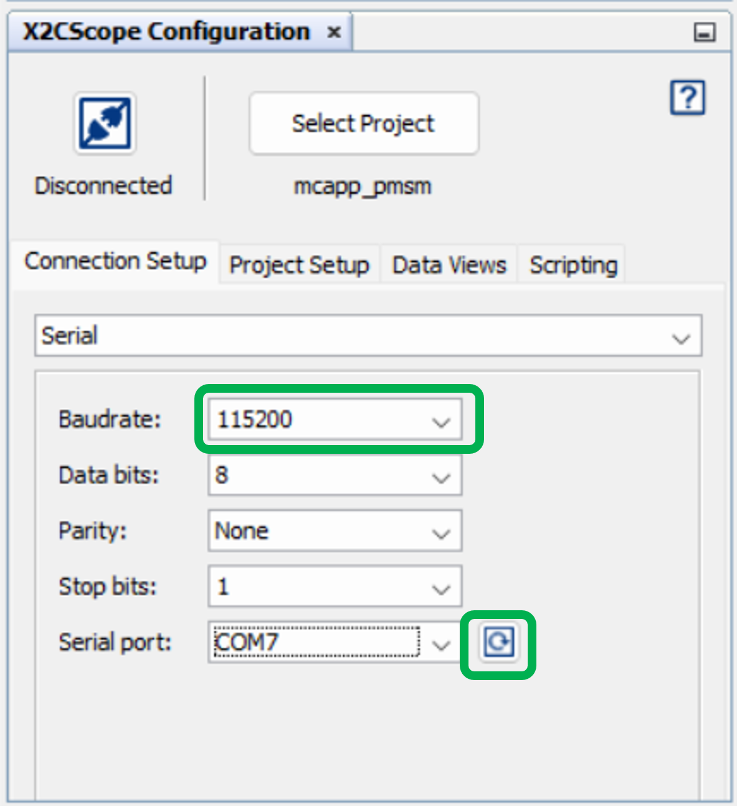

 
## Sensorless FOC of PMSM using PLL estimator integrated with Power Factor Correction: MCHV-230VAC-1.5kW Development Board and dsPIC33CH512MP508 Dual Motor Control DIM

## 1. INTRODUCTION
This document describes the setup requirements to drive a Permanent Magnet Synchronous Motor on the hardware platform [EV78U65A](https://www.microchip.com/en-us/development-tool/ev78u65a) "MCHV-230VAC-1.5kW Development Board"  and
EV62S33A "dsPIC33CH512MP508 Dual Motor Control Dual In-line Module(DIM)".

The firmware includes Sensorless Field Oriented Control (FOC) with PLL Estimator, integrated with Power Factor Correction. It also includes field weakening algorithm to support extended speed operation. 
 

## 2. SUGGESTED DEMONSTRATION REQUIREMENTS

### 2.1 Motor Control Application Firmware Required for the Demonstration

To clone or download this application firmware on GitHub, 
- Navigate to the [main page of this repository](https://github.com/microchip-pic-avr-solutions/mchv230vac1.5kw-33ch512mp508-pmsm-foc-pll-pfc-dualmotor) and 
- On the tab **<> Code**, above the list of files in the right-hand corner, click Code, then from the menu, click **Download ZIP** or copy the repository URL to **clone.**
> **Note:**  
>In this document, hereinafter this firmware package is referred as **firmware.**
### 2.2 Software Tools Used for Testing the firmware

- MPLAB® X IDE **v6.25** 
- Device Family Pack (DFP): **dsPIC33CH-MP_DFP v1.15.378**
- Curiosity/Starter Kits Tool Pack : **PKOB4_TP v1.19.1503**
- MPLAB® XC-DSC Compiler **v3.10**
- MPLAB® X IDE Plugin: **X2C-Scope v1.6.6** 
> **Note:**  
>The software used for testing the firmware prior to release is listed above. It is recommended to use the version listed above or later versions for building the firmware. All previous versions of Device Family Packs (DFP) and Tool Packs can be downloaded from [Microchip Packs Repository.](https://packs.download.microchip.com/)
### 2.3 Hardware Tools Required for the Demonstration
- MCHV-230VAC-1.5kW Development Board  [(EV78U65A)](https://www.microchip.com/en-us/development-tool/ev78u65a) 
- dsPIC33CH512MP508 Dual Motor Control Dual In-line Module (EV62S33A)
- Leadshine (EL5-M0400-1-24) 400W 220VAC Servo Motor[(AC300025)](https://www.microchip.com/en-us/development-tool/AC300025)
- AC Source for powering the Development Board: 150-230Vac rms , 50Hz

> **Note:**  
>  Contact Microchip for dsPIC33CH512MP508 Dual Motor Control Dual In-line Module (EV62S33A).
>  Items [EV78U65A](https://www.microchip.com/en-us/development-tool/ev78u65a),  and [AC300025](https://www.microchip.com/en-us/development-tool/AC300025) are available to purchase directly from [microchip DIRECT](https://www.microchipdirect.com/) 
 

## 3. HARDWARE SETUP
This section describes the hardware setup required for the demonstration.
Refer ["Motor Control High Voltage 230VAC-1.5kW Development Board User's Guide"](https://ww1.microchip.com/downloads/aemDocuments/documents/MCU16/ProductDocuments/UserGuides/Motor-Control-High-Voltage-230VAC-1.5kW-Dev-Board-Users-Guide-DS70005576.pdf), before operating the unit.
> **Note:**  
>In this document, hereinafter the MCHV-230VAC-1.5kW Development Board is referred as **development board**.

1. Motor currents are amplified on the MCHV-230VAC-1.5kW development board. The firmware and DIM are configured to sample and convert external amplifier outputs, measuring the motor currents needed for implementing FOC.

2. Ensure the development board is not powered and it is fully discharged. Verify the LEDs **LD1**(Green) and **LD4**(Red) on Power Factor Correction Board and **LD1**(Green) on Motor Control Inverter Board are not glowing. 

     

     

3. Remove the thumb screw and open the top cover of the enclosure and measure the DC Bus voltage across the terminals which reads approximately '0 VDC'. If the voltage is greater than 1V, wait until it is completely discharged.
4. Insert the **dsPIC33CH512MP508 Dual Motor Control DIM** into the DIM Interface **connector J2** on the development board. Make sure the DIM is placed correctly and oriented before going ahead. Close the top cover of the enclosure and secure it with the thumb screw.

     

     

5. Connect the 3-phase wires from the motor to **A**, **B**, and **C** (no specific order) of the connector J13(**MOTOR**) on the development board.

     

      

6. Power the PFC board using a controlled AC source by applying a voltage within in the range 150-230Vac rms and a frequency of 50Hz through IEC connector **connector J1** provided on the PFC board. If the supply frequency is 60Hz, refer to point No: 5 in the section [Basic Demonstration](#52-basic-demonstration) to change the input frequency in firmware parameters . 

      

      

> **Note:**  
>The Development Board is designed to operate in the 90 to 230Vac rms voltage range with a maximum input current of 10Arms. In the Input AC voltage range of 90 to 150Vac rms, the maximum input power to the Development Board must be derated (<1500W) to maintain the input current through the socket to less than or equal to 10Arms.

5. The Development Board has an on-board programming tool called the Isolated PKoB4 Daughter Board. To use the on-board programmer, connect a micro-USB cable between the Host PC and connector J11(**PROGRAM**) on the development board.
      

      

> **Note:**  
> Use only **shielded micro-USB** cables intended for data transfer.

 6. To establish serial communication with the host PC, connect a micro-USB cable between the host PC and connector J8(**USB-UART**) on the development board. 
      

      

> **Note:**  
> Use only **shielded micro-USB** cables intended for data transfer.
  

## 4. SOFTWARE SETUP AND RUN
### 4.1 Setup: MPLAB X IDE and MPLAB XC-DSC Compiler
Install **MPLAB X IDE** and **MPLAB XC-DSC Compiler** versions that support the device **dsPIC33CH512MP508** and **PKoBv4.** The MPLAB X IDE, MPLAB XC-DSC Compiler, and X2C-Scope plug-in used for testing the firmware are mentioned in the [Motor Control Application Firmware Required for the Demonstration](#21-motor-control-application-firmware-required-for-the-demonstration) section. 

To get help on  
- MPLAB X IDE installation, refer [link](https://microchipdeveloper.com/mplabx:installation)
- MPLAB XC-DSC Compiler installation steps, refer [link](https://developerhelp.microchip.com/xwiki/bin/view/software-tools/xc-dsc/install/)

If MPLAB IDE v8 or earlier is already installed on your computer, then run the MPLAB driver switcher (Installed when MPLAB®X IDE is installed) to switch from MPLAB IDE v8 drivers to MPLAB X IDE drivers. If you have Windows 8 or 10, you must run the MPLAB driver switcher in **Administrator Mode**. To run the Device Driver Switcher GUI application as administrator, right-click on the executable (or desktop icon) and select **Run as Administrator**. For more details, refer to the MPLAB X IDE help topic **“Before You Begin: Install the USB Device Drivers (For Hardware Tools): USB Driver Installation for Windows Operating Systems.”**

### 4.2 Setup: X2C-SCOPE
X2C-Scope is a MPLAB X IDE plugin that allows developers to interact with an application while it runs. X2C-Scope enables you to read, write, and plot global variables (for motor control) in real-time. It communicates with the target using the UART. To use X2C-Scope, the plugin must be installed. To set up and use X2C-Scope, refer to the instructions provided on the [web page](https://x2cscope.github.io/docs/MPLABX_Plugin.html).

## 5.  BASIC DEMONSTRATION
### 5.1 Firmware Description
The firmware version needed for the demonstration is mentioned in the section [Motor Control Application Firmware Required for the Demonstration](#21-motor-control-application-firmware-required-for-the-demonstration) section. This firmware is implemented to work on Microchip’s  dual-core 16-bit Digital signal controller (dsPIC® DSC) **dsPIC33CH512MP508**. For more information, see the **dsPIC33CH512MP508 Family datasheet [(DS70005371D)](https://ww1.microchip.com/downloads/en/DeviceDoc/dsPIC33CH512MP508-Family-Data-Sheet-DS70005371D.pdf)**.

This firmware leverages the dual-core architecture of the dsPIC33CH512MP508 Digital Signal Controller (DSC) to implement a combined power conversion and motor control solution:
- The Main Core executes a Power Factor Correction (PFC) control algorithm for a single-stage boost converter.
- The Secondary Core is configured to control two independent three-phase inverters, each driving a separate motor using the Field-Oriented Control (FOC) algorithm.
> **Note:** 
> The second three-phase motor control inverter board can be inserted via the XPRO connector J4. Peripheral configuration and firmware for running the second motor are integrated. However, the second motor is not tested or demonstrated and is provided only for reference.

Refer to the following PWM Peripheral Example: [dsPIC33CH PWM Peripheral Example for Dual Motor Control with PFC using Sync PCI Feature](https://github.com/microchip-pic-avr-examples/dspic33ch-curiosityboard-pwmexample-dual-motor-control-pfc/tree/1.0.0) for more details on the PWM sychronisation and switching scheme for Dual Motor Control with Power Factor Correction.

The firmware consists of two MPLAB X projects, **main.X** (Main Project) and **mcapp_pmsm.X** (Secondary Project) with the following device selections.

- 
Device selection in Main Project (code for Main Core) is dsPIC33CH512MP508
- 
Device selection in Secondary Project (code for Secondary Core) is dsPIC33CH512MP508S1

 The function of the Main Core is defined by the Main Project main.X and they are:

- 
To set device configuration bits applicable for both Main and Secondary cores (Configuration bits for Main and Secondary cores exist in Main core). Note that the configuration bits decide the I/O port ownership between Main Core and Secondary Core. 
- 
Configure Main Core Oscillator Subsystem to generate clocks needed to operate core and its peripherals. In this firmware, the Main core is configured to operate at 180MHz.
- 
To program and enable the Secondary core by invoking XC-DSC library (<code>libpic30.h</code>) routines <code>_program_secondary()</code> and <code>_start_secondary()</code>.

- 
To execute the Power Factor Correction control algorithm. 

The function of the Secondary Core (as defined in the Secondary Project mcapp_pmsm.X) is:

- 
To configure Secondary Core Oscillator Subsystem to generate clocks needed to operate core and its peripherals. In this firmware, the Secondary core is configured to operate at 200MHz.

- 
To configure I/O ports and Secondary Core peripherals (such as PWM, ADC Cores or UART) required to execute the Motor Control Demo Application . 

Once Main Core programs and enables the Secondary Core, it can autonomously run the Motor Control Demo application residing in its PRAM. The Motor Control Demo application uses a push button to start or stop the motor and a potentiometer to vary the speed of the motor.

The Motor Control Demo application uses a push button to start or stop the motor and a potentiometer to vary the speed of the motor. This Motor Control Demo Application configures and uses peripherals like PWM, ADC, UART, etc. 

> **Note:** 
> The project may not build correctly in Windows OS if the Maximum path length of any source file in the project is more than 260 characters. In case the absolute path exceeds or nears the maximum length, do any (or both) of the following:
> - Shorten the directory name containing the firmware used in this demonstration. If you renamed the directory, consider the new name while reading the instructions provided in the upcoming sections of the document.
> - Place firmware in a location such that the total path length of each file included in the projects does not exceed the Maximum Path length specified.  
> Refer to MPLAB X IDE help topic **“Path, File, and Folder Name Restrictions”** for details. 

### 5.2 Basic Demonstration
Follow the below instructions, step by step, to set up and run the motor control demo application:

1. Start **MPLAB X IDE** and open the project **main.X (File > Open Project)** with device selection **dsPIC33CH512MP508.**  
    

       

  

2. Set the project **main.X** as the main project by right-clicking on the project name and selecting **Set as Main Project** as shown. The project **main.X** will then appear in **bold.**
    

     
 

3. In the project window, right click on the **Secondaries** folder of the project tree (of Main project main.X) and select "Properties". This will open the "Secondaries"category of the Project Properties dialog.
    

     
 
     Verify the “Secondaries” category of Project Properties dialog, and ensure details are as follows (see figure): 
     
     - Item is mcapp_pmsm.X
     - Image name is “mcapp_pmsm”
     - Check Box "Build" is checked
     - Check Box "Debug" is unchecked
    

     
 

4. In the Projects window, open the Secondaries folder of the project tree (of Main project main.X) and double click the project “**mcapp_pmsm**” This will open the Secondary project mcapp_pmsm.X in the MPLAB X IDE project window. Alternatively, you can open (File>Open Project) the Secondary project from its current location like any other MPLAB X project.
    

     
 
     

4. Open <code>**pfc_userparams.h**</code> (**main.X > Header Files> pfc**) inside the main project (**main.X**) .  
     - Ensure that the macro <code>**DEBUG_BOOST**</code> is not defined in the header file <code>**pfc_userparams.h**</code>.        
          
          

          

          
     - Ensure that the macro <code>**PFC_POWER_CONTROL**</code> is defined in the header file<code> **pfc_userparams.h.**</code>
          

          

	
     - Update the input supply frequency by setting the macro <code>**PFC_INPUT_FREQUENCY**</code> in the header file <code>**pfc_userparams.h**</code>
          

          

4. Inside the secondary project (**mcapp_pmsm.X > Header Files**) open <code>**mc1_user_params.h**</code>.  
     - Ensure that the macro <code>**OPEN_LOOP_FUNCTIONING**</code> is not defined for closed loop functioning.
          
 

    - Firmware is configured to run with Leadshine (EL5-M0400-1-24) 400W 220VAC Brushless AC Servo Motor [(AC300025)](https://www.microchip.com/en-us/development-tool/ac300025) by default.  The macro <code>**LEADSHINE_EL5_M0400**</code> should be defined in <code>**mc1_user_params.h**</code>.
          
 

6. Right-click on the project **main.X** and select **Properties** to open its **Project Properties** Dialog. Click the **Conf:[default]** category to reveal the general project configuration information. The development tools used for testing the firmware are listed in section [2.2 Software Tools Used for Testing the firmware.](#22-software-tools-used-for-testing-the-firmware)

     In the **Conf:[default]** category window: 
     - Ensure the selected **Device** is **dsPIC33CH512MP508.**
     - Select the **Connected Hardware Tool** to be used for programming and debugging. 
     - Select the specific Device Family Pack (DFP) from the available list of **Packs.** In this case, **dsPIC33CH-MP_DFP v1.15.378** is selected. 
     - Select the specific **Compiler Toolchain** from the available list of **XC-DSC** compilers. 
     In this case, **XC-DSC(v3.10)** is selected.
     - After selecting Hardware Tool and Compiler Toolchain, Device Pack, click the button **Apply**

     Please ensure that the selected MPLAB® XC-DSC Compiler and Device Pack support the device configured in the firmware

     

     

     The selected device in Secondary project **mcapp_pmsm.X** can be viewed by opening its **Project Properties** Dialog. As can be seen from the figure below, this **Device** is set as **dsPIC33CH512MP508S1**, representing the secondary core of the dsPIC33CH512MP508. 
     

     

7. Ensure that the checkbox **Load symbols when programming or building for production (slows process)** is checked under the **Loading** category of the **Project Properties** window.           
      

      

     Also, go to **Tools > Options** , and
      

      

   
    Open the  **Embedded > Generic Settings** tab and ensure that the **ELF debug session symbol load methodology (MIPS/ARM)** is selected as **Pre-processed (Legacy)** from the drop down.
           
      

      

8. To build the project (in this case, **main.X**) and program the device dsPIC33CH512MP508, click **Make and Program Device Main project** on the toolbar
    

    

  
9. If the device is successfully programmed, **LED1** will be turned **ON**, indicating that the dsPIC® DSC is enabled.
    

     

10. Measure the DC Bus voltage across the terminals (**VDC** and **PGND**) and ensure that the voltage is approximately 380V, as specified by the macro <code>**PFC_OUPUT_VOLTAGE_NOMINAL**</code> in the **pfc_userparams.h** file. 
    

     

> **Note:** 
> Please refer to the Board Inspection Checklist section in the Motor Control High Voltage 230VAC-1.5kW Development Board User’s Guide [(DS70005576)](https://ww1.microchip.com/downloads/aemDocuments/documents/MCU16/ProductDocuments/UserGuides/Motor-Control-High-Voltage-230VAC-1.5kW-Dev-Board-Users-Guide-DS70005576.pdf)
to verify the power supply outputs of the Development Board when a functional failure is suspected or observed.
 

9. Run or stop the motor by pressing the push button **BUTTON 1**. The motor should start spinning smoothly in one direction. Ensure that the motor is spinning smoothly without any vibration. The LED **LED2** is turned **ON** to show the button is pressed to start the motor.
     

     

 

10. The motor speed can be varied using the potentiometer **(POT).**
    

    

 

11. Press the push button **BUTTON 1** to stop the motor.

>**Note:** 
>The macros <code>MINIMUM_SPEED_RPM</code>, <code>NOMINAL_SPEED_RPM</code>, and <code>MAXIMUM_SPEED_RPM</code> are specified in the header file <code>**mc1_user_params.h**</code> included in the project **mcapp_pmsm.X.** The macros <code>NOMINAL_SPEED_RPM</code> and <code>MAXIMUM_SPEED_RPM</code> are defined as per the Motor manufacturer’s specifications. Exceeding manufacture specifications may damage the motor or the board or both.

## 5.3  Data visualization through X2C-Scope Plug-in of MPLAB X

X2C-Scope is a third-party plug-in in MPLAB X, which helps in real-time diagnostics. The application firmware comes with the initialization needed to interface the controller with the host PC to enable data visualization through the X2C-Scope plug-in. Ensure the X2C-Scope plug-in is installed. For more information on how to set up a plug-in, refer to either the [Microchip Developer Help page](https://microchipdeveloper.com/mplabx:tools-plugins-available) or the [web page.](https://x2cscope.github.io/docs/MPLABX_Plugin.html)
 
1. To establish serial communication with the host PC, connect a micro-USB cable between the host PC and **connector J8** on the development board. 

2. Ensure the application is configured and running as described under section [5.2 Basic Demonstration](#52-basic-demonstration) by following steps 1 through 10.

3. Open the **X2C-Scope** window by selecting **Tools>Embedded>X2CScope.**
      

       

4. Right click on the project **mcapp_pmsm** and click **Clean and Build**.
      

       
 

5. **In the X2C-Scope Configuration** window, open the **Connection Setup** tab and click **Select Project.** This opens the drop-down menu **Select Project** with a list of opened projects. Select the specific project **mcapp_pmsm** from the list of projects and click **OK.**
    

    

6. To configure and establish the serial communication for **X2C-Scope**, open the **X2CScope Configuration** window, click on the **Connection Setup** tab and:
     - Set **Baudrate** as **115200**, which is configured in the application firmware. 
     - Click on the **Refresh** button to refresh and update the list of the available Serial COM ports connected to the Host PC. 
     - Select the specific **Serial port** detected when interfaced with the development board. The **Serial port** depends on the system settings

    

     

 

7. Once the **Serial port** is detected, click on **Disconnected** and turn to **Connected**, to establish serial communication between the Host PC and the board.
     

    

8. Open the **Project Setup** tab in the **X2CScope Configuration** window and,
     - Set **Scope Sampletime** as the interval at which <code>X2CScopeUpdate()</code> is called. In this application, it is every <code>62µs</code>. 
     - Then, click **Set Values** to save the configuration.

      

      

9.	Click on **Open Scope View** (in the **Data Views** tab of the **X2CScope Configuration** Window); this opens **Scope Window.**
     

      

    	     
10. In the **Scope Window**, select the variables that must be watched. To do this, click on the **Source** against each channel, and a window **Select Variables** opens on the screen. From the available list, the required variable can be chosen. Ensure checkboxes **Enable** and **Visible** are checked for the variables to be plotted.
To view data plots continuously, uncheck **Single-shot.** When **Single-shot** is checked, it captures the data once and stops. The **Sample time factor** value multiplied by **Sample time** decides the time difference between any two consecutive data points on the plot.
    

    

11.	Click on **SAMPLE**, then the X2C-Scope window plots variables in real-time, which updates automatically.
     

     

 

12.	Click on **ABORT** to stop.
     

     

 
 ## 6. REFERENCES:
For additional information, refer following documents or links.
1. AN1292 Application Note “[Sensorless Field Oriented Control (FOC) for a Permanent Magnet Synchronous Motor (PMSM) Using a PLL Estimator and Field Weakening (FW)](https://ww1.microchip.com/downloads/aemDocuments/documents/OTH/ApplicationNotes/ApplicationNotes/01292A.pdf)”
2. Motor Control High Voltage 230VAC-1.5kW Development Board User’s Guide [(DS70005576)](https://ww1.microchip.com/downloads/aemDocuments/documents/MCU16/ProductDocuments/UserGuides/Motor-Control-High-Voltage-230VAC-1.5kW-Dev-Board-Users-Guide-DS70005576.pdf)
3. dsPIC33CH512MP508 Dual Motor Control Dual In-Line Module (DIM) Information Sheet 
4. dsPIC33CH512MP508 Family datasheet [(DS70005399D)](https://ww1.microchip.com/downloads/aemDocuments/documents/MCU16/ProductDocuments/DataSheets/dsPIC33CH512MP508-Family-Data-Sheet-DS70005399D.pdf)
5. MPLAB® X IDE User’s Guide [(DS50002027)](https://ww1.microchip.com/downloads/en/DeviceDoc/50002027E.pdf) or [MPLAB® X IDE help](https://microchipdeveloper.com/xwiki/bin/view/software-tools/x/)
6. [MPLAB® X IDE installation](http://microchipdeveloper.com/mplabx:installation)
7. [MPLAB® XC-DSC Compiler installation](https://developerhelp.microchip.com/xwiki/bin/view/software-tools/xc-dsc/install/)
8. [Installation and setup of X2Cscope plugin for MPLAB X](https://x2cscope.github.io/docs/MPLABX_Plugin.html)
9. [Microchip Packs Repository](https://packs.download.microchip.com/)
